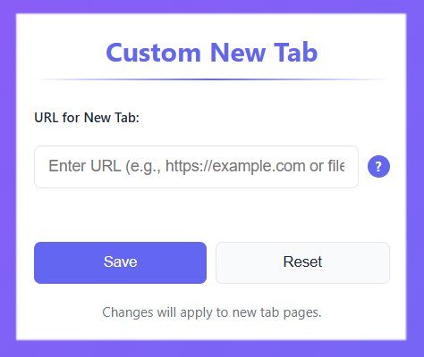

# Custom New Tab Extension

A browser extension that allows you to set any URL (including local file URLs) as your new tab page.

## Installation
Get Custom New Tab extension from the official stores for your desired browser:

- Edge: https://microsoftedge.microsoft.com/addons/detail/custom-new-tab/olkmcdcdlefeekkgeckdoeepfhokcbae
- Chrome: https://chrome.google.com/webstore/detail/olldkplmkcinccioilcpldblnaohgabc
- Firefox: https://addons.mozilla.org/addon/custom-tab-url/

## Features
- Set any web URL as your new tab page.
- Support for local file URLs (`file:///` protocol)
  - _Except in Firefox due to browser limitation._
- Currently published for Edge, Chrome and Firefox.
- No user data collected or tracked.

## Notes
- For local file URLs to work in Edge/Chrome, you may need to enable the checkbox "Allow access to file URLs" in your browser's extension settings.

## Usage
1. Click on the extension icon in your browser's toolbar
2. Enter the URL you want to use for new tabs
3. Click "Save"
4. Open a new tab to see your custom page

## Screenshots
Initial new tab page

Popup for setting custom URL

